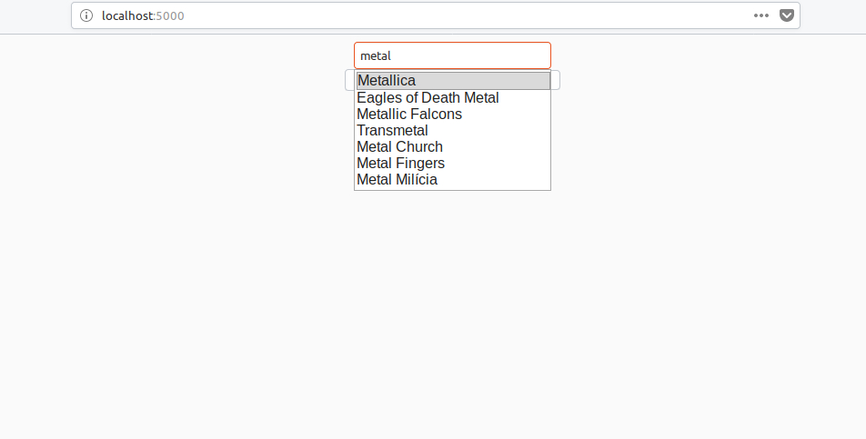
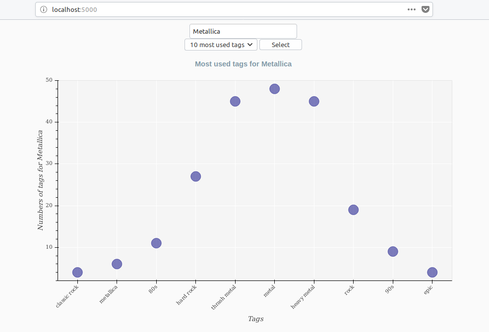

# Data visualization app using Flask, Pandas, Bokeh and jQuery

### Overview
The application uses the `hetrec2011-lastfm-2k` dataset to visualize the most used tags for each artist.


The application uses Flask and uwsgi as web server, Pandas to read data from csv files and prepare data structures to be visualised using Bokeh, it uses also jQuery autocomplete when typing artist name.


Please note that the application needs improvments as its purpose is to solve a 2-hours technical test for a job interview.

### Deployment options
The application can be ran either as a docker container or as a classic Flask application.

#### With Docker
```
$ docker build -t visualization-app .
$ docker run -p 5000:5000 visualization-app
```
The application should be running on [localhost:5000](http://localhost:5000)

#### Without Docker
```
$ sudo pip3 install -r requirements.txt
$ python3 app.py
```
The application should be running on [localhost:5000](http://localhost:5000)

#### Example



### TODO
- [ ] Tests
- [ ] Use Elasticsearch for autocomplete
- [ ] Take into consideration tags timestamps and users
